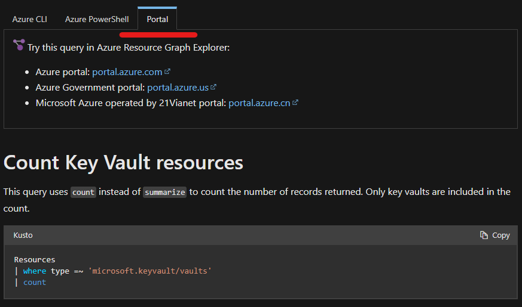

# Azure Resource Graph
This subsection of the repository contains information on the usage of the Azure Resource Graph via KQL. This also includes functions that you can use in combination with other KQL applications, services, sources, tables etc. 

*What is Azure Resource Graph?*

Azure Resource Graph is an Azure service designed to extend Azure Resource Management by providing efficient and performant resource exploration with the ability to query at scale across a given set of subscriptions so that you can effectively govern your environment.

Source: [Resource Graph Docs](https://learn.microsoft.com/en-us/azure/governance/resource-graph/overview)

# Quickstart
To get started with using the Azure Resource Graph, you can navigate to the Azure Resource Graph Explorer in the Azure portal. This lists multiple example queries to get familiar with the syntax.


# What about KQL?
Good question! You can use the resource graph natively from your Sentinel, Log Analytics or ADX environment. 

*IMPORTANT!* The KQL queries are executed with the permissions of your own account, thus only the resources you have access to are returned. Be aware of this when using this for automation tasks/trying to get a complete picture.

To start using Azure Resource Graph in KQL the explanation below can be followed.

List all unique types:
```
arg("").Resources
| distinct type
```

Filter unique type:
```
arg("").Resources
| where type == "microsoft.network/publicipaddresses"
```

Count all resources you have access to.
```
Resources
| summarize count()
```

Parse a nested field to a new column
```
arg("").Resources
| where type == "microsoft.network/publicipaddresses"
| extend ipAddress = tostring(properties.ipAddress)
```

## Examples
Microsoft has provided various KQL examples that can be used in your environment.

- [Starter Resource Graph query samples](https://learn.microsoft.com/en-us/azure/governance/resource-graph/samples/starter?tabs=azure-cli)
- [Advanced Resource Graph query samples](https://learn.microsoft.com/en-us/azure/governance/resource-graph/samples/advanced?tabs=azure-cli)

When using the docs, select portal to get the KQL queries as marked below.


